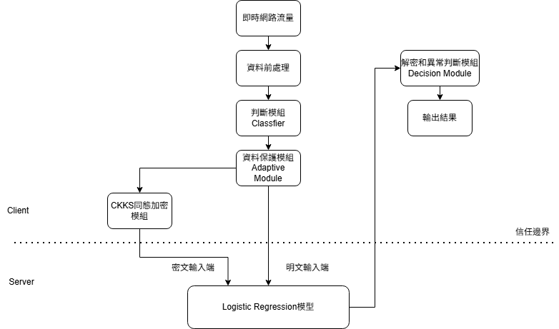

# IDS_APPAD - 自適應隱私保護異常檢測系統

> 基於論文 **"Adaptive Privacy-Preserving Framework for Network Traffic Anomaly Detection"** 的復現實作（本專題聚焦於 **APPAD 系統**）

---

## 🎯 這個系統在做什麼？

簡單來說：**在偵測網路異常（可能是攻擊）的同時，對敏感資訊進行隱私保護。**

- 📊 使用 Logistic Regression（LR）對流量特徵進行異常偵測
- 🔒 若流量含敏感資訊，將敏感特徵以 **CKKS 同態加密**保護（避免伺服器端看到原始敏感值）
- ⚡ 若流量不敏感，直接使用明文推論以降低延遲
- 🎚️ **自適應**：根據資料敏感性決定是否啟用加密

---

## 🏗️ 系統架構圖（APPAD）

### 架構要點（很重要）
1. **Client（可信端）**：持有解密金鑰、負責敏感性判斷與最後決策  
2. **Server（不可信端）**：只做 LR 推論（可以處理明文/密文混合輸入），不做解密、不做 threshold 判斷  
3. **APPAD 的核心**  
   - 只有 **一個 LR 推論邏輯**  
   - 差異在於「輸入資料表示」：可能是明文或部分密文（混合）

---

## 🧩 模組拆分（決策 vs 執行）

### 1) 隱私敏感性判斷模組（Classifier）
**用途**：回答「這筆流量要不要保護？」（決策層）  
- 輸入：原始流量 / 特徵（依你們設計）
- 輸出：
  - `flag ∈ {0,1}`（是否需要加密保護）
  - `sensitive_idx`（哪些特徵屬於敏感範圍；可先用規則/表格定義，後續再用模型權重校正）

> ✅ Classifier **不做加密**，只做判斷。

---

### 2) 自適應保護模組（Adaptive Module）
**用途**：回答「既然要保護，要怎麼保護？」（執行層）  
- 輸入：`x`（特徵向量）、`flag`、`sensitive_idx`
- 輸出：送往 server 的 `payload`（包含明文部分 + 密文部分）

> ✅ Adaptive Module 會呼叫 CKKS 加密（必要時），並組裝資料封包。

---

### 3) LR 推論模組（Server Side）
**用途**：在不可信端完成 LR 的推論計算  
- 輸入：`payload`（可能是明文/密文混合）
- 輸出：`z`（明文 logit）或 `z_enc`（密文 logit）

> ✅ Server 不做 threshold、不做最終分類（因為密文下不適合做比較）

---

### 4) 解密與決策模組（Client Side Decision）
**用途**：在可信端完成最終判斷  
- 若收到 `z_enc`：先解密得到 `z`
- 再做 `z > threshold`（或 sigmoid 後判斷）

> ✅ 最終 anomaly/normal 必須在 Client 端。

---

## 📌 資料集

- **Web_Auth_Anomaly_Detection dataset**
- 本 repo 的 HE PoC 會從 dataset 中抽樣取特徵向量做測試
---

## ✅ HE PoC（Week 1）做什麼、為什麼要做？

本專題的 HE PoC 目標是驗證「APPAD 密文推論的最小可行性」：

1. 建立 CKKS context  
2. 加密/解密真實特徵向量（確認精度與可用性）  
3. 同態加法（加總）  
4. 同態內積（LR 推論核心：`w·x`）  
5. 比對明文結果與解密結果誤差、並量測延遲

---

